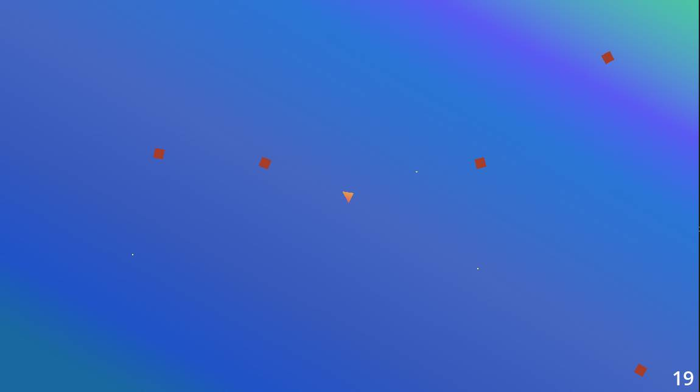

# Triangle Defender

You are a triangle. Your job is to defend yourself from the oncoming horde of squares. This is TRIANGLE DEFENDER.

There are three difficulty levels available to suit different playstyles. In addition, there is an original musical composition included that will hypnotize you into the endless loop of destroying bad guys. Have fun!

## How to Play

You'll want to use the latest version of Godot 4. Download Godot from the [official website](https://godotengine.org/). Open the engine and then import the `project.godot` file in this repository. Once it's done loading, press F5 or click the "play" button in the top right.